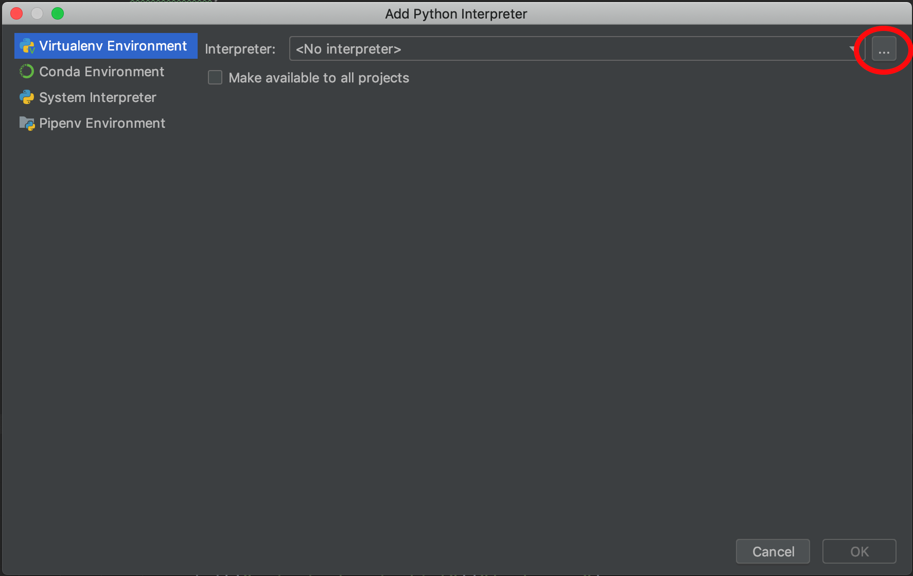

Running Python on M3
====================

M3 has different versions of Python installed. To list them use the command:

.. code-block:: bash

    # Listing python modules
    module avail python

    --------------------------------------------------- /usr/local/Modules/modulefiles ---------------------------------------------------
    python/2.7.11-gcc           python/2.7.15-gcc5          python/3.5.2-gcc5           python/3.6.6-gcc5
    python/2.7.12-gcc4(default) python/3.5.2-gcc            python/3.6.2                python/3.7.2-gcc6
    python/2.7.12-gcc5          python/3.5.2-gcc4           python/3.6.2-static         python/3.7.3-system

The listed Python versions have a standard set of python modules installed using
Pip. As a user, unfortunately, you are unable to update or install your own
python modules into the supplied Python software on Massive.

There is an alternative, to create a Python virtual environment (venv). A Python
virtual environment effectively creates your own copy of Python, allowing you to
install any Python modules you require. The instructions below focus on creating
a Python virtual environment using 3.6.2.

'destinationPath' is the location you use to install Python on Massive.

.. code-block:: bash

    #Setup python virtualenv - need to use this path to avoid 'module load'
    /usr/local/python/3.6.2-static/bin/python3 -m venv destinationPath

    #Activate the virtual environment - do this for each shell session
    source destinationPath/bin/activate

    #Upgrade pip
    pip install --upgrade pip

.. note:: For each new shell session created, 'source destinationPath/bin/activate' is required to use your Python virtual environment.

To better understand Python virtual environments please refer to https://docs.python.org/3/tutorial/venv.html

Using PyCharm with your Virtual environment
-------------------------------------------

After successfully creating your own virtual environment, you can use it in your
PyCharm projects.

The first step is to start PyCharm. Start a Massive desktop session and select PyCharm from the menu.
Please refer to `Connecting to M3 via the MASSIVE desktop <../connecting/connecting-via-strudel.html>`_

1. Once PyCharm is up and running, select File, New Project.

2. You will be presented with the Create Project window. Click on the arrow next
to 'Project Interpreter'

.. figure:: PyCharm-newProject.png
   :alt: PyCharm new project dialog box

3. Select 'Existing interpreter' and click the 'browse' icon.

.. figure:: PyCharm-newProjectInterpreter.png
   :alt: PyCharm new project interpreter dialog box

4. Browse to the location where you created your virtual environment, enter the
'bin' folder, then select the 'python' executable. Click OK.

5. Click OK.

.. figure:: PyCharm-interpreterSelected.png
   :alt: PyCharm new project interpreter dialog box

6. Back on the Create Project window, enter the new project name. Click OK. You
now have a PyCharm project setup using your new virtual environment.
