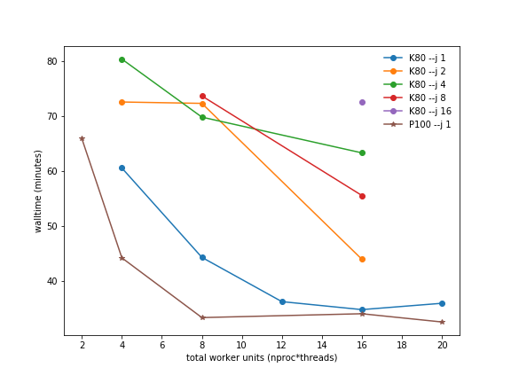
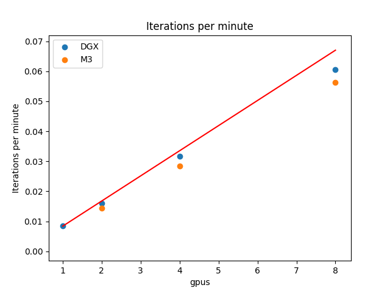

.. attention::
    This documentation is under active development, meaning that it can change over time as we refine it. Please email help@massive.org.au if you require assistance, or have suggestions to improve this documentation.

.. _cryoemindex:

Cryo EM
=======
MASSIVE supports the cryo-EM community with storage and compute services. On these pages we will provide suggestions for workflows and software settings that we have tested to be optimal for a range of datasets. If you have a dataset that you think is taking longer than normal to process or you notice performance issues please let us know and our help team will work with you to resolve the issues.

The four major cryo-EM data processing packages that we have installed for you are:

#. Relion
#. Simple
#. Cryosparc
#. Cryo-EM Processing Tool

Benchmarking has been performed on the software MotionCor2.

To benchmark the software it has been executed using different methods, and on different node configurations. The methods and results are provided below.
Scripts used to run the benchmarks are also available.

Relion
------

The Relion software is capable of running on single desktops, right through to multiple nodes on a compute cluster. Generally, the Relion workflow consists of numerous computationally light (or interactive) steps, and a few steps which demand significant resources. You will probably wish to use the Relion graphical interface to invoke the light (or interactive) steps directly. For the more computationally demanding steps, it is generally best to submit a job to the M3 queuing system.

The Graphical Interface
~~~~~~~~~~~~~~~~~~~~~~~

To utilise the Relion graphical interface, you have two options. The first option is to create a MASSIVE desktop instance, either using `Strudel <http://docs.massive.org.au/M3/connecting/connecting-via-strudel.html#massive-desktop-strudel>`_ or `Strudel Web <http://docs.massive.org.au/M3/connecting/connecting-via-strudel.html#massive-desktop-in-browser-strudel-web>`_. The second option is to utilise `X11 forwarding <https://www.massive.org.au/userguide/cluster-instructions/x11-windows-forwarding>`_.

For MASSIVE desktop usage, note that currently the **Standard Desktop** does not currently provision a CUDA compatible GPU (restricting Relion to CPU processing). You will need to launch a **Large Desktop** if you wish to utilise a GPU. Note also that only Relion 1.4 is available via the desktop menu. To access more recent versions, you will need to open a terminal, `load the required Relion module <https://www.massive.org.au/userguide/cluster-instructions/modules>`_, and then run the ``relion`` executable.

`X11 forwarding <https://www.massive.org.au/userguide/cluster-instructions/x11-windows-forwarding>`_ will utilise your local X11 server to render the Relion instance running remotely on M3. The instance itself may be launched from the login node, although computationally demanding workflow steps must **not** be executed directly. Login nodes are a shared resource reserved for job orchestration, and as such running heavy calculations there may impede other users (and will not be particularly fast!). If you wish to launch heavy jobs directly from the interface, you may launch the GUI directly from a compute node instead. This will allow you to specify exactly the resources you require, but as with the **Large Desktop** resources may not be immediately available. To access a compute node, `launch an interactive command line job <https://www.massive.org.au/userguide/running-slurm-jobs/running-interactive-jobs>`_. Once your job has started, `load the required Relion module <https://www.massive.org.au/userguide/cluster-instructions/modules>`_ and run the ``relion`` executable.

.. tip::
   For particle picking, Relion uses the middle-click to deselect a particle. If you are using OS X, you might need to use a tool like `MiddleClick <http://rouge41.com/labs/>`_ to enable middle click emulation.

Using the Queue
~~~~~~~~~~~~~~~
While running computationally intensive steps directly from the interface is possible (as per instructions above), it is generally most efficient to execute these steps using the `job queuing system <http://docs.massive.org.au/M3/slurm/slurm-overview.html>`_. Processing such as 2d and 3d classification require hours of CPU/GPU time, and while using a sufficiently provisioned interactive (desktop or command line) instance may be a reasonable option, often these will not be available for immediate launch. The queue is also the most efficient choice where you need to submit numerous jobs for processing.

This is a basic queue submission script for Relion:

.. code-block:: bash

    #!/bin/bash
    #SBATCH --job-name=MyJob
    #SBATCH --time=01:00:00
    #SBATCH --ntasks=16
    #SBATCH --cpus-per-tasks=1

    module load relion
    mpirun YOUR_RELION_COMMAND

Here the required Relion command (YOUR_RELION_COMMAND) will depend upon the job within your Relion workflow which you wish to execute. You can determine this command via the ``Print command`` button within the Relion GUI (it will print the command to your terminal, not the GUI).

The other path to submitted M3 queue jobs is via the Relion interface itself. Under the ``Running`` tab, you will need to set the following options:

================================ =====
Number of MPI procs              MPI rank count.
Number of threads                Threads per rank count.
Submit to queue                  Yes.
Queue name                       Ignored.
Queue submit command             sbatch
Job Name (no spaces!)            A name for your job.
Job Time                         Maximum wall time for your job.
Standard submission script       Default script to use.
Minimum dedicated cores per node Ignored.
================================ =====

The resultant queue script forms part of the preamble printed to your job standard output file. You may find it useful to copy this for manual job submission.

Motion Correction
~~~~~~~~~~~~~~~~~
Relion interfaces to MotionCor2 or Unblur for beam induced motion correction. If you are using an interactive instance running on a compute node, executing motion directly from the Relion GUI may be preferred option.

Note that MotionCor2 can utilise GPU accelerators where your compute node is appropriately provisioned. For successful GPU usage, your job execution must be configured very specifically. Firstly, the ``Number of MPI procs`` setting (under the **Running** tab) must equal the number of GPU accelerator cards. Secondly, the ``Which GPUs to use`` setting (under the **Motioncor2** tab) must provide a colon separated list of integer GPU identifiers. For example, using Motioncor2 on the **m3h** partition which has 2 GPUs per node, you would therefore use 2 MPI processes, and you would set the GPUs to use to "0:1". An equivalent queue submission script would be:

.. code-block:: bash

    #!/bin/bash
    #SBATCH --job-name=motion_correction
    #SBATCH --time=01:00:00
    #SBATCH --ntasks=2
    #SBATCH --partition=m3h
    #SBATCH --gres=gpu:2

    module load relion
    module load motioncor2

    mpirun `which relion_run_motioncorr_mpi` --i ./Import/job001/movies.star --o MotionCorr/job033/ --save_movies  --first_frame_sum 1 --last_frame_sum 16 --use_motioncor2 --bin_factor 1 --motioncor2_exe /usr/local/motioncor2/2.1/bin/motioncor2 --bfactor 150 --angpix 3.54 --patch_x 5 --patch_y 5 --gpu "0:1" --dose_weighting --voltage 300 --dose_per_frame 1 --preexposure 0

Note that for this script, we've added the partition specification ``--partition=m3h`` to ensure that the job is launched on a GPU enabled node, and we've requested the 2 GPUs available on these nodes ``--gres=gpu:2``. Also, note that it may be necessary to explicitly specify the MotionCor2 executable in the ``MOTIONCOR2 executable`` dialog under the ``Motioncor2`` tab. You can find the executable by running `which motioncor2` from the command line (after loading the required module).

2d/3d Classification & Refinement
~~~~~~~~~~~~~~~~~~~~~~~~~~~~~~~~~
These jobs are likely to be the most computationally demanding in your Relion workflow. Their expense will scale with the number of particles, and the number of classes you request. Although CPU only operation is possible, GPUs usage will generally yield an order of magnitude performance improvement. Timeframes for these jobs are often measures in hours, so you will most likely need to use the queuing system for efficient operation.

Relion will utilise all provisioned GPUs through the use of MPI processes and/or threads. The optimal choice of these configurations will somewhat depend on the specifics of your jobs. Generally speaking, fastest operation is achieved by utilising 2-4 MPI *worker* ranks **per** GPU, with each having 1-2 threads.

   Walltime vs total workers. 3D Classification benchmark, 5 iteration. M3C partition: Relion 2.04, 4 K80 GPUs. M3H partition: Relion 2.1b1, 2 P100 GPUs.

.. COMMENT OUT UNTIL CONFIRMED: Note that memory usage does also increases with thread count, though in a weaker sense.
  .. figure:: memory.png
     :alt: Memory usage vs MPI/threads

     Peak memory usage vs MPI ranks count. 3D Classification benchmark, 5 iterations, Relion 2.1b1, DGX, 8 P100 GPUs.

Memory usage, however, scales strongly with MPI rank count, and may be prohibitively expensive (depending on your particle box size). It may often be necessary to make a tradeoff between memory usage and performance. Also note that memory usage increases with iteration count as Relion only performs lower resolution reconstructions during early iterations.  `Relion suggests <https://github.com/3dem/relion/blob/75762bcd840d3a8b2a4927fde176a78cafae6641/src/gpu_utils/cuda_ml_optimiser.cu#L2849>`_ the following GPU maximum memory requirements (in gigabytes) for **each** MPI worker on a GPU:

.. math::

   Mem = \frac{2.5*1.05*4*(2*boxsize)^3} {1024*1024*1024}

For large simulations, it may be useful to run early iterations using more performant configurations, and then continue the job using settings with a smaller memory footprint. To continue a job, use the ``--continue`` flag to indicate the required iteration STAR file to continue from. For large enough particle images, GPU usage may not be possible during later iterations, in which case it will be necessary to continue in CPU only mode.

Relion uses a master/worker pattern for MPI job distribution. The total tasks required will therefore equal the number of workers plus one. So for 16 workers, 1 threads per worker, and 2 GPUs, your submission script will be:

.. code-block:: bash

    #!/bin/bash
    #SBATCH --job-name=relion_refine
    #SBATCH --time=01:00:00
    #SBATCH --ntasks=17
    #SBATCH --cpus-per-task=1
    #SBATCH --partition=m3h
    #SBATCH --gres=gpu:2

    module load relion

    mpirun `which relion_refine_mpi` --i Particles/shiny_2sets.star --ref emd_2660.map:mrc --firstiter_cc --ini_high 60 --ctf --ctf_corrected_ref --iter 5 --tau2_fudge 4 --particle_diameter 360 --K 6 --flatten_solvent --zero_mask --oversampling 1 --healpix_order 2 --offset_range 5 --offset_step 2 --sym C1 --norm --scale --random_seed 0 --o class3d --gpu --pool 10 --dont_combine_weights_via_disc --j $SLURM_CPUS_PER_TASK

Note that we use the SLURM environment variable ``SLURM_CPUS_PER_TASK`` to set the number of threads within the Relion command so that it automatically matches what you have requested for your SLURM script.

For certain jobs Relion scales well across multiple nodes, with almost linear speedup with GPU count. If you wish to use more than one node on M3 for a single job, there are some further settings you need to invoke to ensure that Relion is appropriately cast across the provisioned nodes. In particular, we wish to ensure that the distribution of workers per GPU is identical for all GPUs. For example, if we wish to have 4 MPI ranks **per** GPU, we need to set a total of 9 MPI ranks to the first node (1 master rank, plus 4 works per GPU), and then each node thereafter should only have 8 MPI workers (4 for each GPU again). So to utilise 3 nodes we would require a total of 25 MPI ranks, and the necessary script would be:

.. code-block:: bash

    #!/bin/bash
    #SBATCH --job-name=relion_refine_multinode
    #SBATCH --time=01:00:00
    #SBATCH --ntasks=25
    #SBATCH --ntasks-per-node=9
    #SBATCH --cpus-per-task=1
    #SBATCH --partition=m3h
    #SBATCH --gres=gpu:2

    module load relion

    mpirun `which relion_refine_mpi` ...

Note the addition of the flag ``ntasks-per-node`` which limits the number of tasks distributed across each node and ensures the required distribution pattern. Submitting multiple node classification/refinement queue jobs directly from the Relion interface is not currently supported, though you can easily generate a single node job and modify its script as instructed above.

   Iterations per minute vs GPU count. Standard 2D classification benchmark, 5 iterations averaged, Relion 2.1b1. DGX: 8 P100 GPUs. M3, 2 P100 GPUs per node (maximum of 4 nodes used).

Relion provides further options for performance optimisation. Our testing across the `standard 2d & 3d Relion benchmarks <https://www2.mrc-lmb.cam.ac.uk/relion/index.php/Benchmarks_%26_computer_hardware>`_ suggest the following settings will be a good starting point for running on M3:

=============================  =====
dont_combine_weights_via_disc  We use this.
pool                           Usually small values (<10) works best.
no_parallel_disc_io            We don't use this.
preread_images                 We don't use this, although it might help slightly if
                               your entire dataset fits in memory.
=============================  =====

Particle Polishing
~~~~~~~~~~~~~~~~~~
Particle polishing jobs are not GPU accelerated. Your maximum MPI rank count should be equal to two times the number frames in your movie files.

Cryo EM Pre-Processing Tool
---------------------------

The Cryo-EM Pre-Processing Tool has been constructed in Jupyter Lab's user friendly environment. It is available from a Massive Desktop. The tool presents all the options for running MotionCor 2.1, Gctf 1.06 and Gautomatch 0.56. This allows the end user to interactively alter program parameters to obtain the best result for their data.

The three programs have been built into a workflow or can be run separately. For full details on the tool please read the `User Guide. <https://github.com/Characterisation-Virtual-Laboratory/Cryo-EM-Processing-Tool/blob/master/userGuide.md>`_

Cryo EM Benchmarking and Optimisation
-------------------------------------

.. toctree::
   :titlesonly:

   Cryo EM Benchmarking and Optimisation <tuning/tuning>
