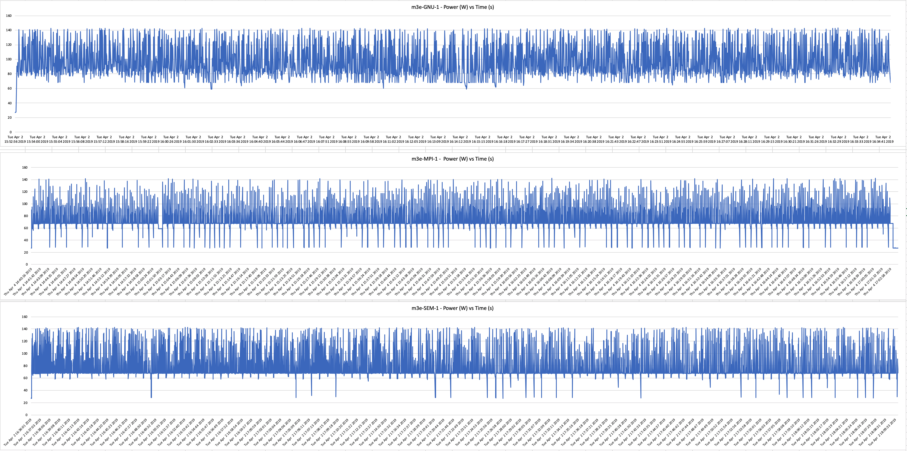

.. attention::
    This documentation is under active development, meaning that it can change over time as we refine it. Please email help@massive.org.au if you require assistance, or have suggestions to improve this documentation.

.. _full_graphsindex:

MotionCor2 Benchmarking - Full graphs
=====================================

.. _graph-gnu-mpi-sem-1gpu:

Graph-GNU-MPI-SEM-1GPU
----------------------

Click to enlarge

.. _graph-gnu-max-transmit:

Graph-GNU-MAX-transmit
----------------------

Click to enlarge

 .. figure:: Graph-GNU-m3g-max_tx-large.png
    :alt: 'Graph GNU m3g tx all data'
    :width: 600pt
    :height: 400pt
