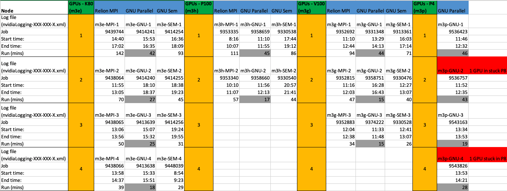
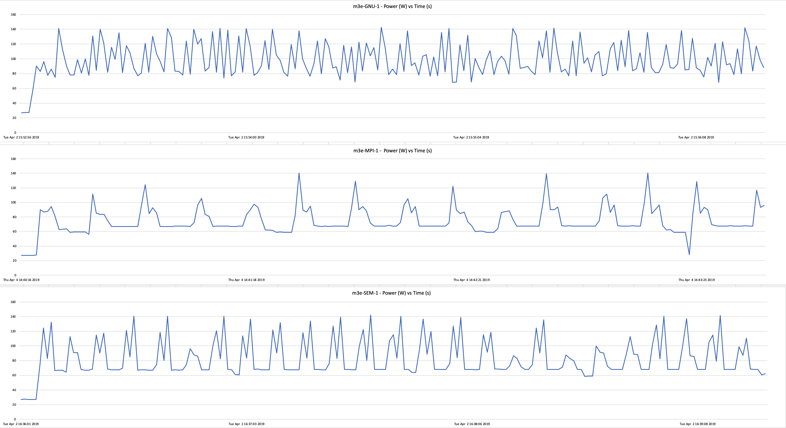
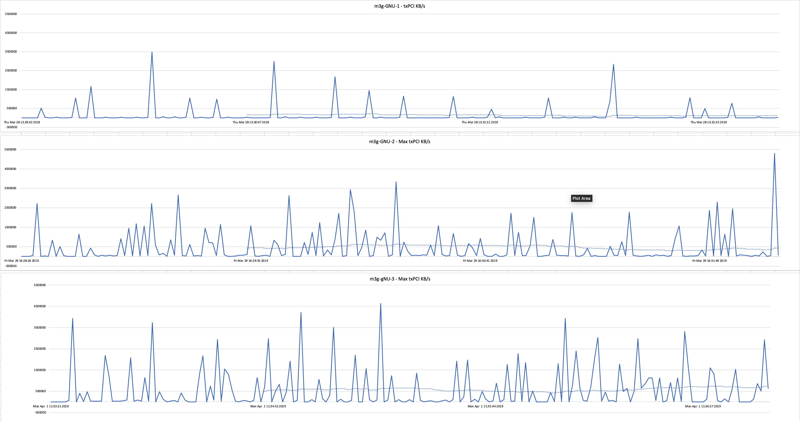

.. attention::
    This documentation is under active development, meaning that it can change over time as we refine it. Please email help@massive.org.au if you require assistance, or have suggestions to improve this documentation.

.. _tuningindex:

Cryo EM Benchmarking and Optimisation
=====================================

MotionCor2 Benchmarking
-----------------------

MotionCor2 was run using several different methods to determine which was best for performance on the cluster.
Initial tests were run using the `Cryo-EM Pre-Processing tool <https://github.com/Characterisation-Virtual-Laboratory/Cryo-EM-Processing-Tool/blob/master/userGuide.md>`_, then using different hardware configurations. Jobs were submitted to Massive using three techniques, the Relion MPI wrapper of MotionCor2, GNU Parallel and GNU Sem.

The test data was EMPIAR dataset `10028 <https://www.ebi.ac.uk/pdbe/emdb/empiar/entry/10028/>`_ The files 001_movie.mrcs to 600_movie.mrcs were used for each performance test.

For each test, the start time, end time and the output from 'nvidia-smi' was obtained.

The following tests were run:

========   ========  ==========================  ======
GPU Type   Max GPUs  Job types                   # Jobs
========   ========  ==========================  ======
K80        4         MPI, GNU Parallel, GNU Sem  12
P100       2         MPI, GNU Parallel, GNU Sem  6
V100       3         MPI, GNU Parallel, GNU Sem  9
P4         4         GNU Parallel                4
========   ========  ==========================  ======

Methods
~~~~~~~

CryoEM Pre-Processing Tool
^^^^^^^^^^^^^^^^^^^^^^^^^^

The CryoEM Pre-Processing Tool exposes all the command line options of MotionCor 2.1 in a user friendly screen interface. Micrographs can be processed using Relion's '.star' file as an input or MotionCor2 can be directed to a folder containing micrographs.

A Massive Advanced Desktop (12 cores Intel Xeon CPU E5-2680, 1 nVidia Tesla K80, 112GB RAM) was used for processing.
To monitor progress 'top', was used in a terminal window.
To monitor the GPU, data was saved to XML using nvidia-smi.

.. code-block:: text

  nvidia-smi -l 1 -q -x -f nvidiaLogging.xml

Using Relion's 'Import' process, a '.star' file was created for the dataset.

Test 1 - '.star' file as input to MotionCor2.

MotionCor2 was allowed to run for 15 minutes, and then manually stopped.

.. code-block:: text

  2:30 pm started
  2:45 pm 30 mrcs processed.
  (600 mrcs / 30) x 15 mins = 300 mins total processing time.

Test 2 - input folder containing the 600 micrographs. All other settings kept the same.

.. code-block:: text

  3:30 pm started.
  3:45 pm 38 mrcs processed
  (600 mrcs / 38) x 15 mins = 236 mins total processing time.

Test 2 is 64 minutes faster than Test 1

While observing 'Test 1', in 'top', the MotionCor2 process could be seen starting and terminating for each micrograph processed.
For 'Test 2', MotionCor2 continued running while processing all micrographs.

Even though this is a basic test, a large performance boost can be obtained by just how you present your micrographs to MotionCor2.
**Setting the input to a folder, is clearly better than using a '.star' file.**

Now for some more complicated testing.

Relion MPI wrapper
^^^^^^^^^^^^^^^^^^

Relion uses a MPI wrapper for executing MotionCor2. A script was built to submit a job to Massive using the wrapper. The script was modified to select the node type and the number of GPUs.

Here is a sample of the script for the Relion MPI wrapper:

.. code-block:: bash

  #!/bin/bash
  #SBATCH --job-name=K80MPI3GPU
  #SBATCH --account=<project code>
  #SBATCH --time=04:00:00
  #SBATCH --nodes=1
  #SBATCH --ntasks=4
  #SBATCH --cpus-per-task=1
  #SBATCH --gres=gpu:K80:3
  #SBATCH --partition=m3c
  #SBATCH --mem=228GB
  # To receive an email when job completes or fails
  #SBATCH --mail-user=firstname.surname@monash.edu
  #SBATCH --mail-type=END
  #SBATCH --mail-type=FAIL

  # Set the file for output (stdout)
  #SBATCH --output=MyJob-%j.out

  # Set the file for error log (stderr)
  #SBATCH --error=MyJob-%j.err

  nvidia-smi -l 1 -q -x -f /home/<username>/<project>/nvidiaLogging-m3c-MPI-3.xml &
  # Get its PID
  nvidiaPID=$!

  module load relion/3.0-stable-cuda91
  module load motioncor2/2.1.10-cuda9.1

  srun -n 3 `which relion_run_motioncorr_mpi` --i Import/job001/movies.star --o JMotionCor/job-m3c-MPI-3/ --save_movies  --first_frame_sum 1 --last_frame_sum 0 --use_motioncor2 --bin_factor 1 --motioncor2_exe /usr/local/motioncor2/2.1.10-cuda9.1/bin/MotionCor2_1.1.0-Cuda91 --bfactor 150 --angpix 1 --patch_x 3 --patch_y 3 --other_motioncor2_args " -PixSize 0.97 " --gpu "" --dose_weighting --voltage 300 --dose_per_frame 1 --preexposure 0

  kill $nvidiaPID

In the above example we are running MotionCor2 using 3 K80 GPUs.  4 tasks are
requested, one for the relion mpi wrapper and one for each of the MotionCor2 processes
per GPU. For each job, the 'nvdia-smi' output and 'relion_run_motioncorr_mpi'
output filenames were changed.

Note: Run one MotionCor2 process per GPU. For further details see Lessons Learnt below.

GNU Parallel
^^^^^^^^^^^^

There is a GNU package available on Massive called Parallel. It is a great way to
parallelise software tasks. For further details refer to the
`GNU website. <https://www.gnu.org/software/parallel/parallel_tutorial.html>`_

Here is a sample of the script for using parallel to run MotionCor2:

.. code-block:: bash

  #!/bin/bash
  #SBATCH --job-name=K80GNU3GPU
  #SBATCH --account=<project code>
  #SBATCH --time=01:30:00
  #SBATCH --nodes=1
  #SBATCH --ntasks=4
  #SBATCH --cpus-per-task=1
  #SBATCH --gres=gpu:K80:3
  #SBATCH --partition=m3c
  #SBATCH --mem=228GB
  # To receive an email when job completes or fails
  #SBATCH --mail-user=firstname.lastname@monash.edu
  #SBATCH --mail-type=END
  #SBATCH --mail-type=FAIL

  # Set the file for output (stdout)
  #SBATCH --output=MyJob-%j.out

  # Set the file for error log (stderr)
  #SBATCH --error=MyJob-%j.err

  export CUDA_CACHE_DISABLE=1

  nvidia-smi -l 1 -q -x -f /home/<userName>/<project code>/nvidiaLogging-m3c-GNU-3.xml &
  # Get its PID
  nvidiaPID=$!

  module load gnuparallel/20190122
  module load motioncor2/2.1.10-cuda9.1

  parallel -j3 --link MotionCor2_1.1.0-Cuda91 -InMrc /projects/m3home/<userName>/<project code>/relion21_tutorial/pMOSP/Micrographs/ -InSuffix {1} -OutMrc /projects/m3home/<userName>/<project code>/relion21_tutorial/pMOSP/JMotionCor/job-m3c-GNU-3/ -Patch 3 3 -Gpu {2} -Serial 1 -FmRef 1 -RotGain 0 -FlipGain 0 -Iter 7 -Tol 0.5 -Bft 150 -StackZ 0 -FtBin 1.0 -InitDose 0 -FmDose 1.0 -PixSize 0.97 -kV 300 -Throw 0 -Trunc 0 -Group 0 ::: 0_movie.mrcs 1_movie.mrcs 2_movie.mrcs ::: 0 1 2

  parallel -j3 --link MotionCor2_1.1.0-Cuda91 -InMrc /projects/m3home/<userName>/<project code>/relion21_tutorial/pMOSP/Micrographs/ -InSuffix {1} -OutMrc /projects/m3home/<userName>/<project code>/relion21_tutorial/pMOSP/JMotionCor/job-m3c-GNU-3/ -Patch 3 3 -Gpu {2} -Serial 1 -FmRef 1 -RotGain 0 -FlipGain 0 -Iter 7 -Tol 0.5 -Bft 150 -StackZ 0 -FtBin 1.0 -InitDose 0 -FmDose 1.0 -PixSize 0.97 -kV 300 -Throw 0 -Trunc 0 -Group 0 ::: 3_movie.mrcs 4_movie.mrcs 5_movie.mrcs ::: 0 1 2

  parallel -j3 --link MotionCor2_1.1.0-Cuda91 -InMrc /projects/m3home/<userName>/<project code>/relion21_tutorial/pMOSP/Micrographs/ -InSuffix {1} -OutMrc /projects/m3home/<userName>/<project code>/relion21_tutorial/pMOSP/JMotionCor/job-m3c-GNU-3/ -Patch 3 3 -Gpu {2} -Serial 1 -FmRef 1 -RotGain 0 -FlipGain 0 -Iter 7 -Tol 0.5 -Bft 150 -StackZ 0 -FtBin 1.0 -InitDose 0 -FmDose 1.0 -PixSize 0.97 -kV 300 -Throw 0 -Trunc 0 -Group 0 ::: 6_movie.mrcs 7_movie.mrcs 8_movie.mrcs ::: 0 1 2

  #1 task - 3 GPUs
  parallel -j1 --link MotionCor2_1.1.0-Cuda91 -InMrc /projects/m3home/<userName>/<project code>/relion21_tutorial/pMOSP/Micrographs/ -InSuffix {1} -OutMrc /projects/m3home/<userName>/<project code>/relion21_tutorial/pMOSP/JMotionCor/job-m3c-GNU-3/ -Patch 3 3 -Gpu {2} -Serial 1 -FmRef 1 -RotGain 0 -FlipGain 0 -Iter 7 -Tol 0.5 -Bft 150 -StackZ 0 -FtBin 1.0 -InitDose 0 -FmDose 1.0 -PixSize 0.97 -kV 300 -Throw 0 -Trunc 0 -Group 0 ::: 9_movie.mrcs ::: "0 1 2"

  kill $nvidiaPID

As for the Relion MPI wrapper, we are running MotionCor2 against 3 K80 GPUs.  4
tasks are requested, one for parallel and one for each of the MotionCor2 processes
per GPU. For each job, the 'nvdia-smi' output and 'MotionCor2'
output filenames were changed.

Let's discuss how this job is run. All of the micrographs in the sample dataset
are numbered 001_movie.mrcs through to 600_movie.mrcs. **We already know that to
obtain the best performance from MotionCor2, we should set the input as a folder,
not a '.star' file.** We have 3 GPUs for this test, so we will be running 3 MotionCor2
processes in parallel.

.. code-block:: text

   parallel -j3 --link MotionCor2_1.1.0-Cuda91 -InMrc /projects/m3home/<userName>/<project code>/relion21_tutorial/pMOSP/Micrographs/ -InSuffix {1} -OutMrc /projects/m3home/<userName>/<project code>/relion21_tutorial/pMOSP/JMotionCor/job-m3c-GNU-3/ -Patch 3 3 -Gpu {2} -Serial 1 -FmRef 1 -RotGain 0 -FlipGain 0 -Iter 7 -Tol 0.5 -Bft 150 -StackZ 0 -FtBin 1.0 -InitDose 0 -FmDose 1.0 -PixSize 0.97 -kV 300 -Throw 0 -Trunc 0 -Group 0 ::: 0_movie.mrcs 1_movie.mrcs 2_movie.mrcs ::: 0 1 2

Above '-j3' tells parallel to run 3 processes at once. Notice the {1} and {2} in
the command and the "::: 0_movie.mrcs 1_movie.mrcs 2_movie.mrcs ::: 0 1 2" at the end.
We are telling parallel to run:

- MotionCor2 for all micrographs ending in '0_movie.mrcs' on GPU 0,
- then to run another MotionCor2 process for all micrographs ending in '1_movie.mrcs' on GPU 1,
- then to run another MotionCor2 process for all micrographs ending in '2_movie.mrcs' on GPU 2

To ensure all of the micrographs are processed, parallel will then be run for all
micrographs ending in 3_movie.mrcs, 4_movie.mrcs and 5_movie.mrcs, then again for the
micrographs ending in 6_movie.mrcs, 7_movie.mrcs and 8_movie.mrcs.

To maximise the processing of the micrographs ending in '9_movie.mrcs', the last
parallel process runs a single MotionCor2, but across all 3 GPUs.

For each node type and the number of GPUs being tested, this script was adjusted to suit.

GNU SEM
^^^^^^^

Parallel also comes with another program named 'sem'.

Here is a sample of the script for using sem to run MotionCor2:

.. code-block:: bash

  #!/bin/bash
  #SBATCH --job-name=K80SEM3GPU
  #SBATCH --account=<project code>
  #SBATCH --time=03:00:00
  #SBATCH --nodes=1
  #SBATCH --ntasks=4
  #SBATCH --cpus-per-task=1
  #SBATCH --gres=gpu:K80:3
  #SBATCH --partition=m3c
  #SBATCH --mem=228GB
  # To receive an email when job completes or fails
  #SBATCH --mail-user=firstname.lastname@monash.edu
  #SBATCH --mail-type=END
  #SBATCH --mail-type=FAIL

  # Set the file for output (stdout)
  #SBATCH --output=MyJob-%j.out

  # Set the file for error log (stderr)
  #SBATCH --error=MyJob-%j.err

  nvidia-smi -l 1 -q -x -f /home/<userName>/<project code>/relion21_tutorial/pMOSP/nvidiaLogging-m3c-SEM-3.xml &
  # Get its PID
  nvidiaPID=$!

  bash /home/<userName>/scripts/motionCor2_1.1.0Cuda91SEM.sh "/home/<userName>/<project code>/relion21_tutorial/pMOSP/Micrographs/*.mrcs" "/home/<userName>/<project code>/relion21_tutorial/pMOSP/JMotionCor/job-m3c-SEM-3/" 0 600 3 3

  kill $nvidiaPID

Pretty straight forward but the smarts are in the next script 'motionCor2_1.1.0Cuda91SEM.sh':

.. code-block:: bash

  #Usage:
  # scriptName micrographPath outputFolder fileStart fileEnd gpuTotal noTasks
  #            "Micrographs/*.mrcs" "JMotionCor/job002/" 0 600 4 12
  #            script supports 1 to 8 GPUs

  i=($1)
  echo ${i[*]}

  outputFolder=$2
  gpuTotal=$5
  gpuNum=0
  noTasks=$6

  module load motioncor2/2.1.10-cuda9.1
  module load gnuparallel/20190122

  sem --wait

  for (( j = $3; j <= $4; j++))
  do
      echo $j; echo "Processing file: " ${i[$j]}
      echo "Using gpu: " $gpuNum
      sem --id $SLURM_JOB_ID -j $noTasks MotionCor2_1.1.0-Cuda91 -InMrc ${i[$j]} -OutMrc $outputFolder$(echo ${i[$j]} | awk '{ print substr( $0, length($0)-13, 3 ) }').mrc -Patch 3 3 -Gpu $gpuNum  -Serial 1 -FmRef 1 -RotGain 0 -FlipGain 0 -Iter 7 -Tol 0.5 -Bft 150 -StackZ 0 -FtBin 1.0 -InitDose 0 -FmDose 1.0 -PixSize 0.97 -kV 300 -Throw 0 -Trunc 0 -Group 0

      if [ $gpuTotal -eq 8 ]; then
          if [ $gpuNum -eq 0 ]; then
               gpuNum=1
          elif [ $gpuNum -eq 1 ]; then
                 gpuNum=2
          elif [ $gpuNum -eq 2 ]; then
                 gpuNum=3
          elif [ $gpuNum -eq 3 ]; then
                 gpuNum=4
          elif [ $gpuNum -eq 4 ]; then
                 gpuNum=5
          elif [ $gpuNum -eq 5 ]; then
                 gpuNum=6
          elif [ $gpuNum -eq 6 ]; then
                 gpuNum=7
          elif [ $gpuNum -eq 7 ]; then
                 gpuNum=0
          fi
      elif [ $gpuTotal -eq 7 ]; then
          if [ $gpuNum -eq 0 ]; then
               gpuNum=1
          elif [ $gpuNum -eq 1 ]; then
                 gpuNum=2
          elif [ $gpuNum -eq 2 ]; then
                 gpuNum=3
          elif [ $gpuNum -eq 3 ]; then
                 gpuNum=4
          elif [ $gpuNum -eq 4 ]; then
                 gpuNum=5
          elif [ $gpuNum -eq 5 ]; then
                 gpuNum=6
          elif [ $gpuNum -eq 6 ]; then
                 gpuNum=0
          fi
      elif [ $gpuTotal -eq 6 ]; then
          if [ $gpuNum -eq 0 ]; then
               gpuNum=1
          elif [ $gpuNum -eq 1 ]; then
                 gpuNum=2
          elif [ $gpuNum -eq 2 ]; then
                 gpuNum=3
          elif [ $gpuNum -eq 3 ]; then
                 gpuNum=4
          elif [ $gpuNum -eq 4 ]; then
                 gpuNum=5
          elif [ $gpuNum -eq 5 ]; then
                 gpuNum=0
          fi
      elif [ $gpuTotal -eq 5 ]; then
          if [ $gpuNum -eq 0 ]; then
               gpuNum=1
          elif [ $gpuNum -eq 1 ]; then
                 gpuNum=2
          elif [ $gpuNum -eq 2 ]; then
                 gpuNum=3
          elif [ $gpuNum -eq 3 ]; then
                 gpuNum=4
          elif [ $gpuNum -eq 4 ]; then
                 gpuNum=0
          fi
      elif [ $gpuTotal -eq 4 ]; then
          if [ $gpuNum -eq 0 ]; then
               gpuNum=1
          elif [ $gpuNum -eq 1 ]; then
                 gpuNum=2
          elif [ $gpuNum -eq 2 ]; then
                 gpuNum=3
          elif [ $gpuNum -eq 3 ]; then
                 gpuNum=0
          fi
      elif [ $gpuTotal -eq 3 ]; then
          if [ $gpuNum -eq 0 ]; then
               gpuNum=1
          elif [ $gpuNum -eq 1 ]; then
                 gpuNum=2
          elif [ $gpuNum -eq 2 ]; then
                 gpuNum=0
          fi
      elif [ $gpuTotal -eq 2 ]; then
          if [ $gpuNum -eq 0 ]; then
               gpuNum=1
          elif [ $gpuNum -eq 1 ]; then
                 gpuNum=0
          fi
      fi
      date
  done
  sem --id $SLURM_JOB_ID --wait

The script has been built to handle a total of 8 GPUs, but here is the main line.

.. code-block:: text

  sem --id $SLURM_JOB_ID -j $noTasks MotionCor2_1.1.0-Cuda91
  -InMrc ${i[$j]}
  -OutMrc $outputFolder$(echo ${i[$j]} | awk '{ print substr( $0, length($0)-13, 3 ) }').mrc
  -Patch 3 3
  -Gpu $gpuNum
  -Serial 1 -FmRef 1 -RotGain 0 -FlipGain 0
  -Iter 7 -Tol 0.5 -Bft 150 -StackZ 0
  -FtBin 1.0 -InitDose 0 -FmDose 1.0
  -PixSize 0.97 -kV 300 -Throw 0 -Trunc 0
  -Group 0

For our example, sem will run a total of 3 MotionCor2 processes, being 1 per GPU.
sem will start 3 processes, when one completes processing a single micrograph and
terminates, sem will start another until all micrographs are processed - maintaining
a total of 3 MotionCor2 processes at any time. **We know that running MotionCor2 by
processing a single micrograph at a time is slow, but looking at the results below,
GNU sem, is consistently faster than using the Relion MPI wrapper.**

Summary of Results
~~~~~~~~~~~~~~~~~~

The clear winner is GNU Parallel, but we should understand why. The basic testing
using the CryoEM Processing Tool provides the answer. The jobs run using
the Relion MPI wrapper are all based on a '.star' file input, when MotionCor2 runs
it starts, processes a single micrograph, terminates and then repeats for the next
micrograph. The SEM jobs are similar, MotionCor2 processes a single micrograph,
terminates and starts again for the next one. Using Parallel, it was much easier
to write scripts to run MotionCor2 pointed at a directory with filtered file names.

Here is a plot of a single K80 GPU processing the micrographs using GNU Parallel,
SEM and the Relion MPI wrapper. The data shown is power draw vs time. The graph
shows a partial run, to aid visibility.

Click to enlarge.

For a graph of the full run, see :ref:`graph-gnu-mpi-sem-1gpu`.

Higher power draw equates to greater processing load. For GNU Parallel, the wattage
ramps up and doesn't drop below 60 W for the whole job, but for SEM and MPI jobs,
it frequently drops down to 28 W. The GNU Parallel job is able to keep the GPU under
higher load, which is why it completes faster.

For the V100 nodes, the GNU Parallel jobs for 2 and 3 GPUs had the same running time. The expectation
is that 3 GPUs should be faster. The storage system in these jobs is the limiter for performance.
For the graphs below the PCI transmit rate of the GPUs has been summed. The Y axis has been zoomed in to
take a closer look at the moving average.

Click to enlarge.

For a graph of the full run, see :ref:`graph-gnu-max-transmit`.

Scripts and Results
~~~~~~~~~~~~~~~~~~~

All of the job scripts (*.sh) and nvidia-smi data (*.xml) have been placed into a GitHub repository.
Please use the scripts to improve the efficiency of your MotionCor2 jobs, even better
improve upon the scripts.

An Excel spreadsheet 'BenchMarkingGraphs-v2.xls' has been uploaded. It contains
the nvidia-smi output for all nodes, the summary, plus some graphs.

`GitHub: Characterisation Virtual Laboratory - Benchmarking Results. <https://github.com/Characterisation-Virtual-Laboratory/CVL-Benchmarking>`_

Lessons learnt
~~~~~~~~~~~~~~

Run one MotionCor2 process per GPU will ensure cleanly run jobs.

As part of this benchmarking journey, jobs were created to run multiple MotionCor2 processes
per GPU. This seemed OK, but if the total amount of GPU memory was exceeded, all processes
on that GPU would terminate. As a workaround, the number of processes were set to
ensure the GPU memory wasn't exceeded. This seemed fine, but on some GPU types,
inconsistent and strange results were observed. e.g. GPUs slowly grinding to a
halt during processing and becoming non responsive and inconsistent benchmark running
times. To address this, the next step attempted was to try different versions of
MotionCor2. It was discovered that on newer versions (1.2.1), MotionCor now checks for
existing processes on the GPU, if another MotionCor2 process is detected it terminates.
After reading the MotionCor documentation more closely, it mentions this issue.
MotionCor2 does not support multiple copies of itself running per GPU. After learning this,
all scripts were updated to ensure a single MotionCor2 process per GPU.

MotionCor2 version 1.1.0 Cuda 9.1 was used in these benchmarks.

MotionCor2 version 1.2.1 was found to check for existing processes on a GPU and terminate.

.. toctree::
   :titlesonly:

   MotionCor2 Benchmarking - Full graphs <graphs/full_graphs>
