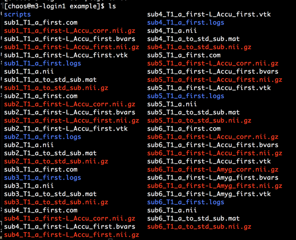

.. attention::
    This documentation is under active development, meaning that it can
    change over time as we refine it. Please email help@massive.org.au if
    you require assistance, or have suggestions to improve this documentation.

Neuroimaging
************

This section covers workflows to assist the Neuroimaging Community.

Human Connectome Project Data Set
=================================

MASSIVE hosts a copy of the Human Conectome Project (HCP) Data, 900 and 1200 
subject series. This data is restricted to M3 users that have their email 
registered with HCP (i.e. an account) **AND** have accepted the HCP terms and 
conditions associated with the datasets. 

The data is located at:

.. code-block:: bash

    /scratch/hcp
    /scratch/hcp1200

The following outlines the process of getting access to this data:

Human Connectome Project Steps for Access
-----------------------------------------

Create an Account
+++++++++++++++++
1. Follow the "Get Data" link to: http://www.humanconnectome.org/data/
#. Select "Log in to ConnectomeDB"
#. Select "Register"
#. Create an account and make sure that your email address matches the email associated with you MASSIVE account
#. You will recieve an email to validate your account

Accept Terms and Conditions
+++++++++++++++++++++++++++
1. Login to https://db.humanconnectome.org/
2. Accept terms and conditions using the "Data Use Terms Required" button on all 3 datasets (WU-Minn, WU-Minn HCP Lifespan Pilot and MGH HCP Adult Diffusion)

MASSIVE Steps for Access
------------------------

Request Access to HCPdata
+++++++++++++++++++++++++
If you have completed the Human Connectome Project steps above you can request 
access with this link: `HCPData <https://hpc.erc.monash.edu.au/karaage/software/7/>`_.

We will verify your MASSIVE email against the HCP site and grant access.

Accessing the Data
++++++++++++++++++
The data is available on M3 via `/scratch/hcp` and `/scratch/hcp1200`
You can also create a symbolic link to this in your home directory using

.. code-block:: bash 

    ln -s /scratch/hcp ~/hcp
    ln -s /scratch/hcp1200 ~/hcp1200
    
    
Note: The Connectome Workbench is available via the MASSIVE Desktop. Any updates
to this or other software requirements can be directed to help@massive.org.au

Using SLURM to submit a simple FSL job
======================================

Example data at ``/home/chaos/kg98/chaos/SLURM/first/example``

Background
----------
* `FIRST <https://fsl.fmrib.ox.ac.uk/fsl/fslwiki/FIRST/UserGuide>`_ is a simple tool in the FSL library to segment sub-cortical regions of a structural image.
* It usually takes 20 minutes to process each image.
* The typical output is a group of image masks of all sub-cortical regions, e.g., hippocampus, amygdala…

Data and scripts
----------------

* 6 T1-weighted structural images

  .. image:: fsl/image4.png

* Three files in the script directory
   * Id.txt = base name list of these imaging files (check basename function for further help)
   * First_task.txt = file with the resource and environment detail of one ``fsl-first job`` **NEED TO change the DIR for the correct path of input data**
   * Submit_template= loop to submit all six jobs.

To run the job, simply do

.. code-block:: bash

  $bash submit_template

Try to use

.. code-block:: bash

  squeue -u (your_masssive_accName) 
  
to check the job.

Output log files:

 * Log files should appear in the script folder, recording all the logs of ``fsl-first`` command

 
Output data:

 * Output data should start to pop up in the data folder

